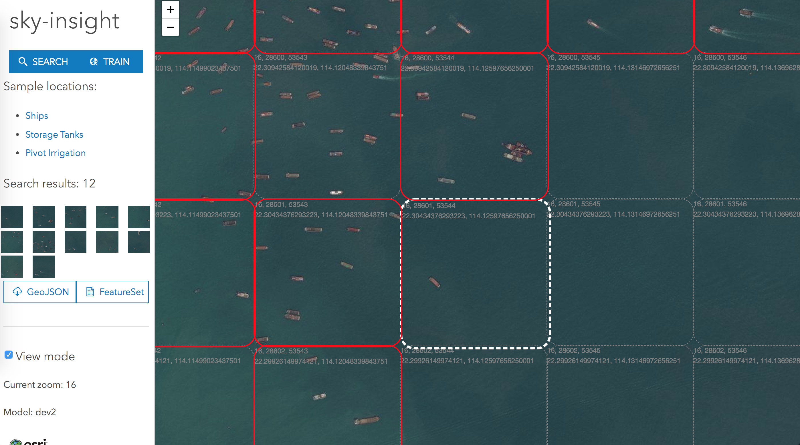
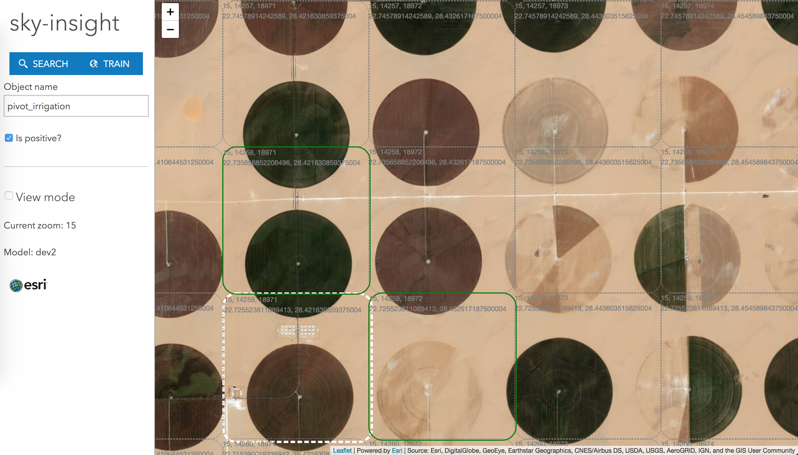

# sky-insight


sky-insight allows you to:
- Easily train image classification machine learning models using satellite/aerial tile imagery & ArcGIS.
- Enrich your existing GIS data with real world planetary data.
- Monitor the physical world with ease using automation & image classification.

It features two modus operandi:
### Search


Search mode allows you to use your trained models or any existing models to automatically infer/predict on an area of interest of tiles.  You can then export your predictions as feature sets or geojson.  Above image is a ship tile classifier. 

### Train


Train mode allows you to easily train your own image classification models using a simple tile annotation tool.  So you can build ship, airplane, oil tank, pivot irrigation farm classifiers- or whatever you fancy.  Above image is training of a pivot irrigation tile classifier. 


## Build & Run

``` bash
# install dependencies
npm install

# rename sample.env.js to env.js and fill in tokens

# serve with hot reload at localhost:8080
npm run dev

# build for production with minification
npm run build
```

For detailed explanation on how things work, consult the [docs for vue-loader](http://vuejs.github.io/vue-loader).
